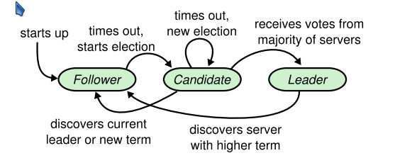
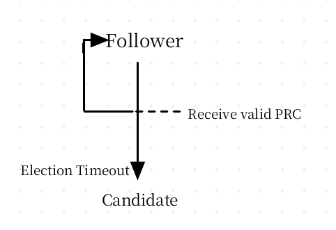
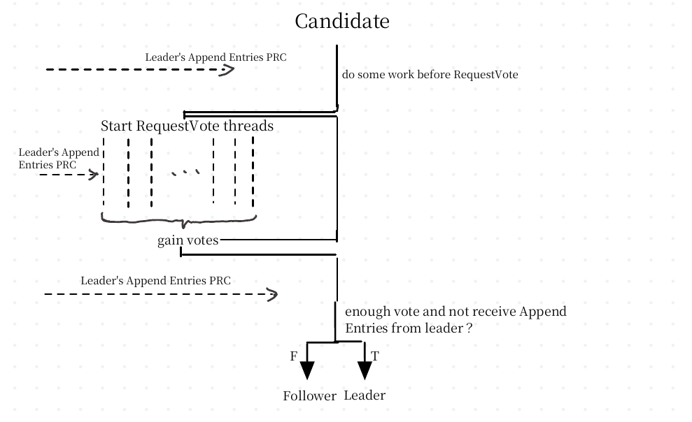
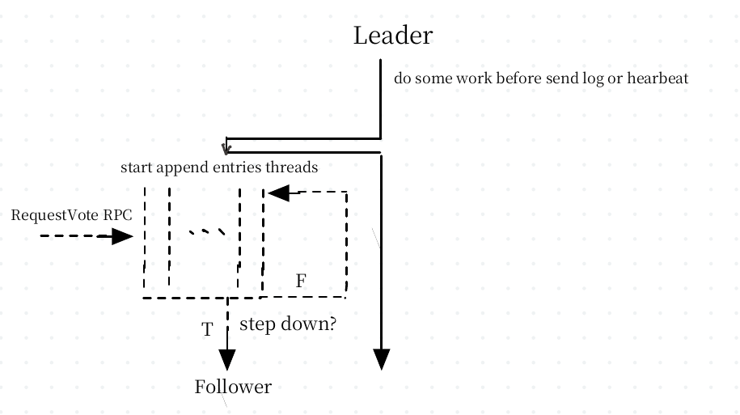

# Raft

## Prerequisite

* Timer: [Callback-Timer](https://github.com/messenger1th/Callback-Timer)
* RPC: Third-Part [buttonrpc](https://github.com/button-chen/buttonrpc_cpp14) 
* State Machine: [Key-Value DataBase](https://github.com/messenger1th/SkipList)

## Flow

### Starts Up

be a follower when set_callback up, steps as follows.

1. read configuration from configuration file.
   1. all servers in cluster and their IP address & Port information.
2. set_callback a timer for election, run a RPC server in thread for vote request, append entry requests.

## Roles

### Follower

* Respond to RPCs from candidates and leaders
* If election timeout elapses without receiving `AppendEntries` RPC from current leader or granting vote to candidate: convert to candidate

### Candidate

* On conversion to candidate, start election.
  * Increment `current_term`
  * vote for self (**to avoid endless voting.**)
  * rest election timer
  * send `request_vote` RPC to all servers.

* if votes received from majority of servers, become leader.
* if `append_entries` RPC received from new leader: convert to follower. (**make sure its valid leader by log & term check**)
* if election timeout elapse: start new election.  

**Structure**

### Leaders

* Upon election: send initial empty append_entries RPCs(heartbeat) to each server; repeat idle periods to prevent election timeouts.
* If command received from client: append entry to local log, respond after entry applied to state machine. (**Respond after applied to state machine means its committed, would recovery from disk if server crash**)
* If `last_log_index >= next_index` for a follower: send append_entries RPC with log entries starting at `next_index`
  * If successful: update `next_index` and `match_index` for follower. (**Difference between `next_index` and `match_index`**)
  * If `append_entries` fails because of log inconsistency: decrement next_index and retry. (**This can be optimized: follower telling leader the concrete  consistent log index rather than try to avoid multi network delay.)**
* If there exists an N such that `N > commit_index`, a majority of `match_index[u] >= N`, and `log[N].term == current_term`. (**Notice: `log[N].term == current_term` is very necessary. see Figure 8 in Paper.**)

**Structure**

## Special Condition

### Restart From Crash

start from a follower no matter what' s server's state.

everything Just like Starts up.

### Member change 

TODO: no code implementation.

### Optimize

*  follower telling leader the concrete  consistent log index rather than try to avoid multi network delay

  

### Snapshot

* Copy-On-Write
* Let Leader not install snapshot, but become follower after a period of time initiatively to install snapshot.

## Details not Mentioned in Paper

**What's the difference of `last_applied`, `commit_index`, `next_index`, `last_log_index`？**

`lasp_applied <= commit_index <= next_index <= last_log_index`

* `lasp_applied` indicate the index of log has been applied by state machine.
* `commit_index` means the index of log that has been replicated to majority of server,  can be safely applied.
* `next_index` is property only for leader, guess next log index send to server.
* `last_log_index` is the log' s last index.

**What' the difference between `commit_index` and `match_index` ?**

>  `matchIndex` is an accurate value indicating the index up to which all the log entries in leader and follower match. However, `nextIndex` is only an optimistic "guess" indicating which index the leader should try for the next `AppendEntries` operation, it can be a good guess (i.e. it equals `matchIndex + 1`) in which case the `AppendEntries` operation will succeed, but it can also be a bad guess (e.g. in the case when a leader was just initiated) in which case the `AppendEntries` will fail so that the leader will decrement `nextIndex` and retry.

Link: https://stackoverflow.com/questions/46376293/what-is-lastapplied-and-matchindex-in-raft-protocol-for-volatile-state-in-server

**When to set `voteFor` to `null` ?** 

if RPC request or response contains term T > current term,  set it `null`.

when a server receives a `RequestVote` RPC with a term higher than its own, it should update the term to the number observed **and also restart the `votedFor` to `null`** (meaning that in this case, it will always vote for the requesting server).

Link: https://stackoverflow.com/questions/50425312/in-raft-distributed-consensus-what-do-i-set-votedfor-to

**Will a candidate with huge current term break current term?**

Yes, as mentioned above, anytime leader receive a term higher than its current term, will update its term and convert to a follower.

Link: https://stackoverflow.com/questions/71230789/raft-will-term-increasing-all-the-time-if-partitioned

a way to avoid this is to use 2-phase Request-Vote. 

**When should a follower set its election timer?**

1. before checking the log matching property
2. Follower decides to grant its vote to that Candidate

Link: https://stackoverflow.com/questions/66944088/when-should-a-raft-follower-record-an-rpc

**When should a leader set voteFor to null while receiving a voteRequest with higher term in Raft?**

> For example, if you have already voted in the current term, and an incoming RequestVote RPC has a higher term that you, you should first step down and adopt their term (thereby resetting votedFor), and then handle the RPC, which will result in you granting the vote!

Namely when receiving a `voteReqest` RPC with higher term, set `voteFor` to `null` and operate later log check, rather than just set `voteFor` to `null` and return false.

Link: [Raft Q&A](https://thesquareplanet.com/blog/raft-qa/)

**Should a leader hold a timer and step down if timeout or in some special condition?** 

## Problem&How to Solve

**How to understand ?** 

> A leader is not allowed to update `commitIndex` to somewhere in a *previous* term (or, for that matter, a future term). Thus, as the rule says, you specifically need to check that `log[N].term == currentTerm`. This is because Raft leaders cannot be sure an entry is actually committed (and will not ever be changed in the future) if it’s not from their current term. This is illustrated by Figure 8 in the paper.

Actually, committing log wit a previous term, which  means possibly be applied to state machine,  will causing inconsistency because these logs maybe overwritten in some condition like Figure 8 mentioned in paper.

Other Answer: https://stackoverflow.com/questions/60397950/confusion-about-raft-algorithm

**How does Raft deals with delayed replies in `AppendEntries` RPC?**

https://stackoverflow.com/questions/56677690/how-does-raft-deals-with-delayed-replies-in-appendentries-rpc 

**How to make persistent value written atomic ?** 

Todo: maybe operating system support.

## Reference

1. [Raft Paper](https://raft.github.io/raft.pdf)

2. [MIT-6.824 Lab](https://pdos.csail.mit.edu/6.824/)

3. [Blog](https://thesquareplanet.com/blog/students-guide-to-raft/)

   

### FAQ Links

1. https://thesquareplanet.com/blog/raft-qa/
2. > [Why Raft never commits log entries from previous terms by counting replicas](https://stackoverflow.com/questions/60397950/confusion-about-raft-algorithm)
