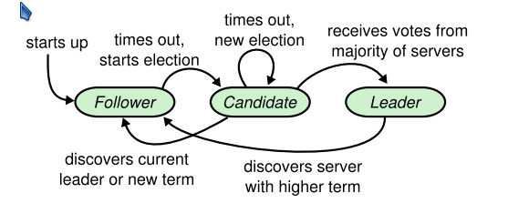

# Raft

## Flow

### Starts Up

be a follower when set_callback up, steps as follows.

1. read configuration from configuration file.
   1. all servers in cluster and their IP address & Port information.
2. set_callback a timer for election, run a RPC server in thread for vote request, append entry requests.

### Election: As Follower

do nothing but response to RPC request like voting  and append entry and reset election timer every time it receive RPC request from leader or candidate.

### Election: As Candidate

after being a candidate, steps  as follows.

revert to follower state anytime receives a valid append entry which means a new leader win the vote. 

1. set a voting timer, if election timeout, set_callback a new election.
2. increase  current  term, otherwise voting request will be rejected.
3. vote for self
4. if timeout, reset elec set_callback a new election.
5. sent `VoteRequest` RPC in parallel, become leader if granted by majority, finish this election before election timer set_callback a new election. 

### Restart From Crash

#### Restart: As Follower

#### Restart: As Candidate

#### Restart: As Leader

### Add a new Server into Cluster

## Details not Mentioned in Paper

### When to set `voteFor` to `null` ? 

if RPC request or response contains term T > current term,  set it `null`.

when a server receives a `RequestVote` RPC with a term higher than its own, it should update the term to the number observed **and also reset the `votedFor` to `null`** (meaning that in this case, it will always vote for the requesting server).

Link: https://stackoverflow.com/questions/50425312/in-raft-distributed-consensus-what-do-i-set-votedfor-to

### Will a candidate with huge current term break current term?

Yes, as mentioned above, anytime leader receive a term higher than its current term, will update its term and convert to a follower.

Link: https://stackoverflow.com/questions/71230789/raft-will-term-increasing-all-the-time-if-partitioned

### When should a follower set its election timer?

1. before checking the log matching property
2. Follower decides to grant its vote to that Candidate

Link: https://stackoverflow.com/questions/66944088/when-should-a-raft-follower-record-an-rpc

## Problem&How to Solve

